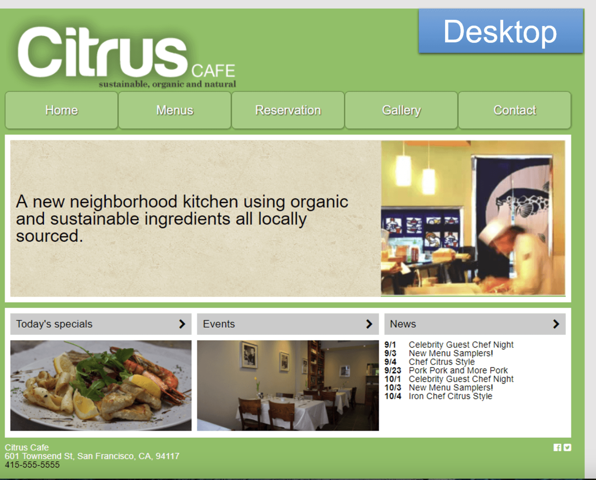
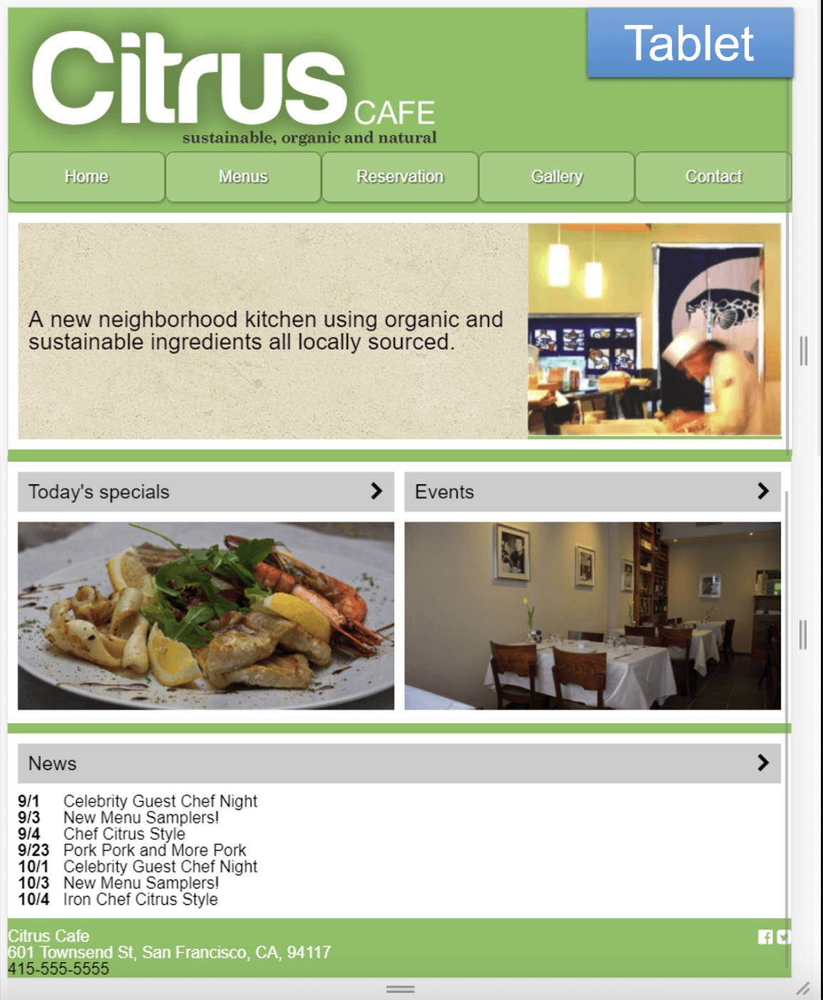
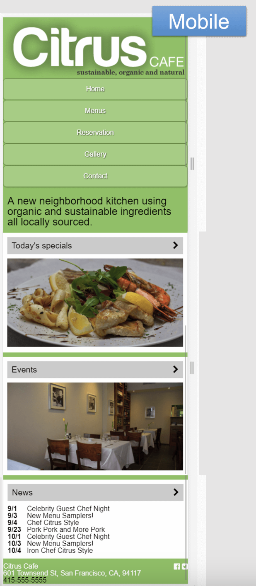

# Citrus Cafe - Responsiivinen Sivuprojekti

Tämä projekti on osa responsiivisen suunnittelun harjoittelua, jossa käytettiin **HTML5** ja **CSS3** luomaan Citrus Cafe -sivusto. Sivustolla on erilaisia asetteluratkaisuja, jotka skaalautuvat sujuvasti eri laitteille (mobiili, tabletti ja desktop). Sivun tavoitteena on simuloida yksinkertaista ravintolasivustoa, joka esittelee päivän erikoiset, tapahtumat ja uutiset.

## Näet livenä:

[Citrus Cafe Live Demo](https://saima445.github.io/09-citrus-cafe/)

## Projektin Yleiskuvaus

Sivusto on suunniteltu seuraavien oppien mukaisesti:

- **Responsiivisuus**: Sivusto skaalautuu saumattomasti eri laitteille käyttäen "mobile-first" -lähestymistapaa.
- **Navigaatio**: Yksinkertainen ja selkeä navigointipalkki, joka muuttuu mobiiliystävälliseksi pienemmillä näytöillä.
- **Flexbox-asettelut**: Sivun rakenne ja asettelu on toteutettu joustavasti CSS Flexboxilla.
- **Media Queries**: Media queryjen avulla sivu mukautuu tablet- ja desktop-näkymiin.

## Ominaisuudet

- **Etusivu**: Sisältää vision ravintolasta ja kuvan.
- **Päivän erikoiset ja tapahtumat**: Erikoistarjoukset ja tapahtumat näkyvät erillisissä laatikoissa.
- **Uutiset**: Lista ajankohtaisista tapahtumista ravintolassa.
- **Yhteystiedot**: Footerissa näkyvät yhteystiedot ja sosiaalisen median ikonit.

## Esimerkkisivun kuvat

